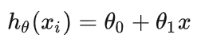
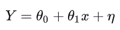

# 损失函数总结

场景假设：现在需要对图像进行分类，即执行分类任务，怎么衡量分类效果的好坏呢

## 1.分类错误率损失

定义为分类错误的比上分类整个的比率。

但这样无法衡量如下情况：

## 2.均方误差损失

### 2.1概念

就是将n个样本的估计值和真实值之间的误差进行平方和再求均值

### 2.2推导

那么MSE是怎么来的

假设现在有一个二维平面的直线

假定输入是带有噪声的（即样本不是一条直线的原因是因为有噪声），并且我们假定这个噪声它是高斯白噪声，

并且这个噪声项$$η$$，服从标准正太，那么就有

接下来利用似然估计来最大化似然函数，似然函数如下：

- 单个样本点的概率

- 似然函数

  

- 对数似然函数

  

**是不是很眼熟呢，对数似然函数与MSE具有相同的形式，由此可见，使用MSE作为损失函数的条件是我们假定噪声是服从高斯分布的。**

### 2.3为什么不用MSE来分类呢

因为MSE在刚开始训练时，如果使用sigmoid作为激活函数会导致训练非常慢，梯度几乎消失，以下是推导：

.PNG)

## 3.交叉熵损失函数

### 3.1定义

### 3.2举例

看上边的定义不太容易理解，以下就三分类问题进行举例

1表示该样本属于这个类别，那么就要让他对应的乘积项变得尽可能得小，也就是让概率变得尽可能得大。其实不难看出在经过crossentropy损失函数之前必须要做softmax。

### 3.3反向传播

梯度随着偏差的大小改变，当最开始差的多得时候，梯度更新也更快。

## ToDo:

- [ ] CrossEntropy求导公式推导
- [ ] 其他类型的损失函数总结