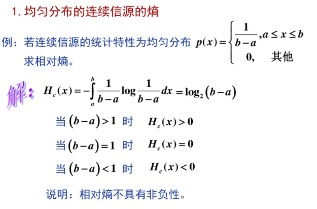

# 交叉熵详解

笔者在本科就系统学习过通信原理和概率论，但是最近在推导扩散概率模型的时候又感到了陌生，因此复习一下信息论中熵的概念，并给出新的感悟！

## 1.信息

**信息可以被认为是和概率相关的。**

比如我说太阳明天从东方升起，这句话的信息量就大约是0，因为我不说你也知道，换句话说你也已经清楚了太阳运行规律的概率分布。

再举一个例子，我看新闻听说了第三次世界大战将在后天爆发（ps：本人是和平的爱好者），这句话的信息量就非常非常大，因为从今天的客观来讲这是一个很小概率的事件。

**值得注意的是，信息量的大小与信息交互的双方关系很大。**

还是刚才的例子，假如说我是个很厉害的人，我已经完全清楚了世界大战爆发这个事情的规律，而且确实第三次世界大战就会在后天爆发，那么新闻的消息对我来说的信息量也是0，而一般人，他们并不清楚世界大战爆发的概率分布，他们仍然会觉得这个事情的信息量很大，从而可以用这个信息去更新他们的认知，这之后再有人说，信息量对他们来说也是不大了。

如何量化信息，感谢香农爷爷：

性质：

- 可加性，即独立事件的信息是可以相加的。

## 2.信息熵

**信息熵：即为一个信源的平均自信息。**

这里有两个概念要解释：

- 信源：就是产生概率分布的一个实体，他既可以产生离散的概率分布，也可以产生连续的。比如这个信源是在发电报，那就是产生离散的，要么是0要么是1。同样这个信源也可以输出一种连续变化的值。
  - 离散信源的熵很容易计算，是有限值。
  - 连续信源的熵理论上无穷大，我们智能计算相对熵，忽略无穷大的项。
- 平均就是说计算的是所有可能发送符号的信息量的加权平均，这个权重就是这个符号出现的概率，说白了就是对信息求个均值。

列出两个常见连续分布的相对熵

## 3.交叉熵

上面我们讲的都是从信源来看，信源自己是完全清楚自己的概率分布的（但是信源肯定不知道影响概率分布的因素，因为如果他知道，概率分布在他知道的那一刻就会发生改变，举个例子，我们假设信息都是真实的，不存在谣言。今天我在等地铁，我知道地铁10分钟一趟，在我进地铁站的时候我认为地铁到达的时间是均匀分布，也就是说0-10分钟内随机到达，但是当我看到地铁站的大屏幕，说地铁还有3分钟到，那么这一刻开始地铁到达时间在我心里就不是均匀分布了，而变成了一个均值为3，方差非常非常小的高斯分布，因为除非天塌地陷，地铁就是会在3分钟后准时到达。）

ok，上边扯了一些没用的，我们扯回来。

假设下面的情况：

我们两个人在说话，讨论明天的天气，假如现在轮到我发言（我作为信源输出信息）

此时我是非常清楚我所说消息的概率分布的，我明确得知道明天下雨得概率是0.8，不下雨概率0.2，但是此时的你还不知道，你就随便猜，觉得明天下雨概率0.5。

那么我说的话客观上来说是有信息量的也就是有熵的（这个客观是指对于一般的吃瓜群众而言，他们啥都不知道），而你是均匀得猜，你的熵计算出来就肯定比我的大。换句话说，我对明天下不下雨这个事情比你有更多的认识。

那么咱们之间差了多少呢，我们就可以计算交叉熵。

这里P是我，Q是你。

最理想的情况下，你现在已经拥有了和我一样的信息，所以你能得到和我一样的概率分布，此时具有最小的熵，否则熵都是比较大的。

**这就可以建模一种学习的能力。**

机器学习中的交叉熵就是从这来的，比如我们用交叉熵损失。label就是已经确定的分布，这也是为什么用one-hot，因为他满足离散的概率分布呀。

然后神经网络就像是一个人在学习一样，他根据目前已经有的信息（比如说一张图片），经过他自己的特征提取和运算，来输出它认为的离散概率分布（分类问题），然后会拿自己的理解和真实的情况进行对照，不足的地方它加以改进（梯度下降），期待下次能有更接近真实分布的表现。

**或许这就是神经网络的本质吧，我们在不断得设计新的结构，让他能根据现有的信息计算到非常接近我们人类所理解的概率分布。**